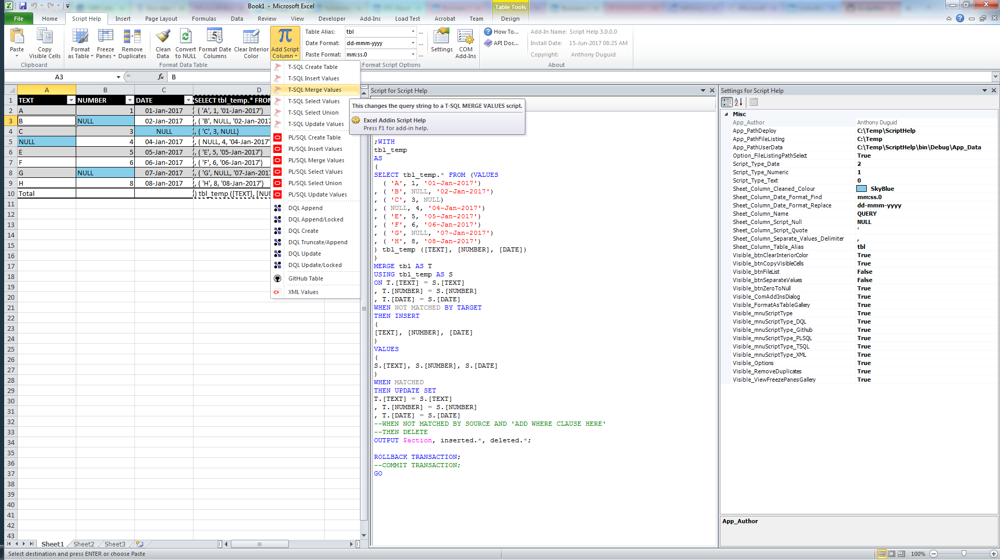

# ScriptHelp

This is an Excel 2010 VSTO Addin written in Visual Studio Community 2017 C#. It allows the user to use an Excel table to create different SQL scripts.

<h1 align="center">
  
</h1>


## Overview
This is used for bulk data loads into SQL Server, Oracle and Documentum.  The functionality within the ribbon allows a quick way of preparing a bulk data load.  Otherwise the requests can be both time-consuming and error prone. 

* Standard format (Excel spreadsheets) for data 
* Standard format for loader scripts 
* Excel addin to clean and format data to be suitable for data loader script 

## Dependencies
|Software                                   |Dependency                 |
|:------------------------------------------|:--------------------------|
|[Microsoft Visual Studio Community 2017](https://www.visualstudio.com/vs/whatsnew/)|Solution|
|[Microsoft Excel 2010](https://www.microsoft.com/en-au/software-download/office)|Project|
|[Microsoft SQL Server CE 3.5](https://www.microsoft.com/en-au/download/details.aspx?id=5783)|Database|
|[Sandcastle](https://github.com/EWSoftware/SHFB)|API documentation|
|[Word Processor](https://www.libreoffice.org/)|As Built documentation|
|Log4Net |Error Logging |

## Glossary of Terms

| Term                      | Meaning                                                                                  |
|:--------------------------|:-----------------------------------------------------------------------------------------|
| COM |Component Object Model (COM) is a binary-interface standard for software components introduced by Microsoft in 1993. It is used to enable inter-process communication and dynamic object creation in a large range of programming languages. COM is the basis for several other Microsoft technologies and frameworks, including OLE, OLE Automation, ActiveX, COM+, DCOM, the Windows shell, DirectX, UMDF and Windows Runtime.  |
|DQL |DQL is used to query Documentum which is a content management system used to create, manage, deliver, and archive all types of content from text documents and spreadsheets to digital images, HTML, and XML components. DQL uses syntax that is a superset of ANSI-standard SQL (Structured Query Language) DQL statements operate on objects and sometimes on tables/rows but SQL statements operate only on tables/rows |
|PL/SQL |PL/SQL (Procedural Language/Structured Query Language) is Oracle Corporation's procedural extension for SQL and the Oracle relational database |
|T-SQL |Transact-SQL (T-SQL) is Microsoft's and Sybase's proprietary extension to SQL. SQL, the acronym for Structured Query Language | 
|UNION |The SQL UNION operator combines the result of two or more SELECT statements.|
|VSTO |Visual Studio Tools for Office (VSTO) is a set of development tools available in the form of a Visual Studio add-in (project templates) and a runtime that allows Microsoft Office 2003 and later versions of Office applications to host the .NET Framework Common Language Runtime (CLR) to expose their functionality via .NET.|
|XML|Extensible Markup Language (XML) is a markup language that defines a set of rules for encoding documents in a format that is both human-readable and machine-readable.The design goals of XML emphasize simplicity, generality, and usability across the Internet.[5] It is a textual data format with strong support via Unicode for different human languages. Although the design of XML focuses on documents, the language is widely used for the representation of arbitrary data structures[6] such as those used in web services.|

## Functionality
This Excel ribbon named “Script Help” is inserted after the “Home” tab when Excel opens.  Listed below is the detailed functionality of this application and its components.  

<h1 align="center">
  
</h1>

###	Clipboard (Group)

####	Paste (Button)
* Paste the contents of the clipboard

####	Copy Visible Cells (Button)
* Copies only the visible cells from a selection

### Format Data Table (Group)
These buttons have the following constraints: 
* Only runs on visible columns. Column hiding can be used to control which columns are included in the script formula. 
* Attempt to automatically determine data type of column (text, numeric, date) in order to apply correct quoting and formatting. 
* For numeric columns if a specific number format has been applied to the entire column then this will be used when formatting the data. This can be used to control the specific data load format of a numeric column if needed. 
* Deliberately creates a formula for the VALUES clause rather than just creating VALUES directly as the cell value. This is so any mistakes made in determining quoting or data format can be corrected by manually editing the topmost formula and this will then be automatically applied to all (visible) rows in the table.

####	Format as Table (Button)
* Quickly format a range of cells and convert it to a Table by choosing a pre-defined Table Style. 

####	Freeze Panes (Button)
* Keep a portion of the sheet visible while the rest of the sheet scrolls
* Defaults to invisible from the install

#### Remove Duplicates (Button)
* Delete duplicate rows from a sheet
* Defaults to invisible from the install

#### Clean Data (Button)
* This feature runs through all the data in the table and removes unprintable characters and trims leading and trailing spaces. 
* The number of cells cleaned is shown in a message box and cleaned cells are highlighted. 
* Currently, there must be at least 2 rows in the table

####	Convert to Null (Button)
* Replaces the zero string values in a named range with “NULL” text value.

#### Format Date Columns (Button)
* When data is cut and pasted from SSMS into Excel, for whatever reason, Excel chooses to format the dates with the (useless) format "mm:ss.0". This seems to be impossible to configure. 
* This feature applies the format "dd-mmm-yyyy" to all date columns it detects in the active table.  If there are zero strings in the column instead of “NULL”s, then the column is treated as a string.

#### Clear Interior Color (Button)
* Clears the interior color of cells in a named range or data table.

#### Separate Values (Button)
* Separate values into new rows from the selected column by a delimited string value setting

#### Add Script Column (Menu Buttons)
* T-SQL Create Table - This menu item will format the script column to drop/create the table then insert the values
* T-SQL Insert Values – This menu item will format the script column to use individual insert statements
* T-SQL Merge Values – This menu item will format the script column to use a merge statement with a select values
* T-SQL Select Values – This menu item will format the script column to be used in insert statements 
* T-SQL Select Union – This menu item will format the script column to be used in an update statement 
* T-SQL Update Values – This menu item will format the script column to use individual update statements
* PL/SQL Create Table - ```TODO: update the syntax from Microsoft to Oracle```
* PL/SQL Insert Values – This menu item will format the script column to use individual insert statements
* PL/SQL Merge Values - ```TODO: create a CTE with SELECT from DUAL for values in a MERGE statement```
* PL/SQL Select Values - ```TODO: create a CTE with SELECT from DUAL for values```
* PL/SQL Select Union – This menu item will format the script column to be used in an update statement 
* PL/SQL Update Values – This menu item will format the script column to use individual update statements
* DQL Append – This menu item will format the script column to be used in an append statement for Documentum (this is used for repeating values)
* DQL Append/Locked – This menu item will format the script column to be used in an append statement for Documentum (this is used for repeating values) and unlocks and then locks the record.
  * The table must contain a column header with 'WHERE'. 
  * Add “WHERE” before the column name in the header you want to use as criteria.
* DQL Create – This menu item will format the script column to be used in an create statement for Documentum
* DQL Truncate/Append – This menu item will format the script column to be used in an truncate and then append statement for Documentum (this is used for repeating values).
  * The table must contain a column header with 'WHERE'. 
  * Add “WHERE” before the column name in the header you want to use as criteria.
* DQL Update – This menu item will format the script column to be used in an update statement for Documentum
* DQL Update/Locked – This menu item will format the script column to be used in an update statement for Documentum and unlocks and then locks the record.
  * The table must contain a column header with 'WHERE'. 
  * Add “WHERE” before the column name in the header you want to use as criteria.
* GitHub table - creates a table format for GitHub Read Me documentation
* XML Values - creates XML structure

###	Format Script Options (Group)

#### Table Alias (Dropdown)
* Changes the prefix to the header and footer line script column
* These values can be updated using the build button “…” to the right of the dropdown

#### Date Format (Dropdown)
* This is the date format the script uses to replace the formatting for date columns. 
* It defaults to ‘dd-mmm-yyyy’, and can be changed by the dropdown value or free text
* These values can be updated using the build button “…” to the right of the dropdown

#### Paste Format (Dropdown)
* This is the format the script looks for to finds dates
* It defaults to ‘mm:ss.0’, and can be changed by the dropdown value or free text
* These values can be updated using the build button “…” to the right of the “Date Format” dropdown

#### Create File List (Button)
* This will create a file listing recursively from a user selected directory
* It will save the .csv and .bat file in the root folder selected.

#### Settings (Button)

##### Types of Settings
###### Application
* These settings can only be changed in the project and need to be redeployed
* They will appear disabled in the form

###### User
* These settings can be changed by the end-user
* They will appear enabled in the form

#### COM Addins (Button)
* Manage the available COM Add-ins
* Defaults to invisible from the install

###	About (Group)

#### How To… (Button)
* How to use this Excel Addin

#### API Doc.. (Button)
* View API documentation for this product

#### Description (Label)
* The application name with the version

#### Install Date (Label)
* The install date of the application

#### Copyright (Label)
* The author’s name
