<html>
<head>
</head>


# Script Help <span class="Application_Version">3.0.0.0</span> 

This is an Excel Add-In written in Visual Studio Community 2017 C#/VB.NET and VBA. This is used for bulk data loads into SQL Server, Oracle, Documentum, Markup and Markdown Languages. The functionality within the ribbon allows a quick way of preparing a bulk data load.  Otherwise, the requests can be both time-consuming and error prone. This has now been tested on Windows (7, 8.1, 10) & Excel (2010, 2013, 2016).

[](LICENSE "MIT License Copyright © 2017 Anthony Duguid")
[](http://github.com/aduguid/ScriptHelp)
[](http://github.com/aduguid/ScriptHelp/fork)

[](https://github.com/aduguid/ScriptHelp/issues)
[](https://github.com/aduguid/ScriptHelp/raw/master/VBA/ScriptHelp.xlsm?raw=true "Download the VBA Add-In")
[](https://github.com/aduguid/ScriptHelp/CS/blob/master/publish/setup.exe?raw=true "Download Setup.exe Install File")
[](https://github.com/aduguid/ScriptHelp/CS/blob/master/AnthonyDuguid.pfx?raw=true "Download AnthonyDuguid.pfx And Install At Root Level For VSTO")

  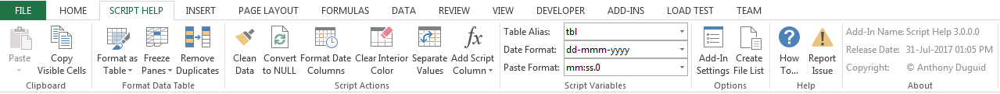

## Table of Contents
- <a href="#dependencies">Dependencies</a>
- <a href="#glossary-of-terms">Glossary of Terms</a>
- <a href="#functionality">Functionality</a>
    - <a href="#clipboard">Clipboard</a>
        - <a href="#paste">Paste</a>
        - <a href="#copy-visible-cells">Copy Visible Cells</a>
    - <a href="#format-data-table">Format Data Table</a>
        - <a href="#format-as-table">Format as Table</a>  
        - <a href="#freeze-panes">Freeze Panes</a>
        - <a href="#remove-duplicates">Remove Duplicates</a>
    - <a href="#script-actions">Script Actions</a>
        - <a href="#clean-data">Clean Data</a>
        - <a href="#convert-to-null">Convert to Null</a>
        - <a href="#format-date-columns">Format Date Columns</a>        
        - <a href="#clear-interior-color">Clear Interior Color</a>
        - <a href="#separate-values">Separate Values</a>
        - <a href="#add-script-column">Add Script Column</a>
          - <kbd><a href="#menu-tsql" target="_blank"></a></kbd><a href="#menu-tsql"> T-SQL (Transact-Structured Query Language)</a>
          - <kbd><a href="#menu-plsql" target="_blank"></a></kbd><a href="#menu-plsql">  PL/SQL (Procedural Language/Structured Query Language)</a>
          - <kbd><a href="#menu-dql" target="_blank"></a></kbd><a href="#menu-dql">  DQL (Documentum Query Language)</a>
          - <kbd><a href="#menu-github" target="_blank"></a></kbd><a href="#menu-github">  GitHub Markdown</a>
          - <kbd><a href="#menu-markup" target="_blank"></a></kbd><a href="#menu-markup">  Markup Language</a>
    - <a href="#format-script-options">Script Variables</a>
        - <a href="#table-alias">Table Alias</a>  
        - <a href="#date-find-format">Find Format</a>  
        - <a href="#date-replace-format">Replace Format</a>  
    - <a href="#options">Options</a>
        - <a href="#settings">Add-In Settings</a>  
        - <a href="#create-file-list">Create File List</a>  
    - <a href="#about">Help</a>
        - <a href="#how-to">How To...</a>  
        - <a href="#api-doc">Report Issue</a>  
        - <a href="#api-doc">Download New Version</a>  
    - <a href="#about">About</a>
        - <a href="#description">Add-in Name</a>
        - <a href="#install-date">Release Date</a>  
        - <a href="#copyright">Copyright</a>  

<a id="user-content-dependencies" class="anchor" href="#dependencies" aria-hidden="true"> </a>
## Dependencies
|Software                                   |Dependency                 |Project                    |
|:------------------------------------------|:--------------------------|:--------------------------|
|[Microsoft Visual Studio Community 2017](https://www.visualstudio.com/vs/whatsnew/)|Solution|VSTO|
|[Microsoft Office Developer Tools](https://blogs.msdn.microsoft.com/visualstudio/2015/11/23/latest-microsoft-office-developer-tools-for-visual-studio-2015/)|Solution|VSTO|
|[Microsoft Excel 2010 (or later)](https://www.microsoft.com/en-au/software-download/office)|Project|VBA, VSTO|
|[Visual Basic for Applications](https://msdn.microsoft.com/en-us/vba/vba-language-reference)|Code|VBA|
|[Extensible Markup Language (XML)](https://www.rondebruin.nl/win/s2/win001.htm)|Ribbon|VBA, VSTO|
|[Microsoft SQL Server CE 3.5](https://www.microsoft.com/en-au/download/details.aspx?id=5783)|Database|VSTO|
|[SQL Server Compact Toolbox](https://marketplace.visualstudio.com/items?itemName=ErikEJ.SQLServerCompactSQLiteToolbox)|Database|VSTO|
|[Sandcastle](https://github.com/EWSoftware/SHFB)|API Documentation|VSTO|
|[Log4Net](https://www.nuget.org/packages/log4net/) |Error Logging |VSTO|
|[ScreenToGif](http://www.screentogif.com/)|Read Me|VBA, VSTO|
|[Snagit](http://discover.techsmith.com/snagit-non-brand-desktop/?gclid=CNzQiOTO09UCFVoFKgod9EIB3g)|Read Me|VBA, VSTO|
|Badges ([Library](https://shields.io/), [Custom](https://rozaxe.github.io/factory/), [Star/Fork](http://githubbadges.com))|Read Me|VBA, VSTO|
<a id="user-content-glossary-of-terms" class="anchor" href="#glossary-of-terms" aria-hidden="true"> </a>
## Glossary of Terms

| Term                      | Meaning                                                                                  |
|:--------------------------|:-----------------------------------------------------------------------------------------|
| COM |Component Object Model (COM) is a binary-interface standard for software components introduced by Microsoft in 1993. It is used to enable inter-process communication and dynamic object creation in a large range of programming languages. COM is the basis for several other Microsoft technologies and frameworks, including OLE, OLE Automation, ActiveX, COM+, DCOM, the Windows shell, DirectX, UMDF and Windows Runtime.  |
| DQL |DQL is used to query Documentum which is a content management system used to create, manage, deliver, and archive all types of content from text documents and spreadsheets to digital images, HTML, and XML components. DQL uses syntax that is a superset of ANSI-standard SQL (Structured Query Language) DQL statements operate on objects and sometimes on tables/rows but SQL statements operate only on tables/rows |
| HTML|Hypertext Markup Language is the standard markup language for creating web pages and web applications|
| PL/SQL |PL/SQL (Procedural Language/Structured Query Language) is Oracle Corporation's procedural extension for SQL and the Oracle relational database |
| T-SQL |Transact-SQL (T-SQL) is Microsoft's and Sybase's proprietary extension to SQL. SQL, the acronym for Structured Query Language | 
| UNION |The SQL UNION operator combines the result of two or more SELECT statements.|
| VBA |Visual Basic for Applications (VBA) is an implementation of Microsoft's event-driven programming language Visual Basic 6 and uses the Visual Basic Runtime Library. However, VBA code normally can only run within a host application, rather than as a standalone program. VBA can, however, control one application from another using OLE Automation. VBA can use, but not create, ActiveX/COM DLLs, and later versions add support for class modules.|
| VSTO |Visual Studio Tools for Office (VSTO) is a set of development tools available in the form of a Visual Studio add-in (project templates) and a runtime that allows Microsoft Office 2003 and later versions of Office applications to host the .NET Framework Common Language Runtime (CLR) to expose their functionality via .NET.|
| XML|Extensible Markup Language (XML) is a markup language that defines a set of rules for encoding documents in a format that is both human-readable and machine-readable.The design goals of XML emphasize simplicity, generality, and usability across the Internet. It is a textual data format with strong support via Unicode for different human languages. Although the design of XML focuses on documents, the language is widely used for the representation of arbitrary data structures such as those used in web services.|
<body>

<a id="user-content-functionality" class="anchor" href="#functionality" aria-hidden="true"> </a>
## Functionality
This Excel ribbon is inserted after the “Home” tab when Excel opens. Listed below is the detailed functionality of this application and its components.  

<a id="user-content-clipboard" class="anchor" href="#clipboard" aria-hidden="true"> </a>
###	Clipboard (Group)
<h1 align="left">
  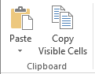
</h1>

<a id="user-content-paste" class="anchor" href="#paste" aria-hidden="true"> </a>
####	Paste (Menu)
* Paste the contents of the clipboard

<a id="user-content-copy-visible-cells" class="anchor" href="#copy-visible-cells" aria-hidden="true"> </a>
####	Copy Visible Cells (Button)
* Copies only the visible cells from a selection

<a id="user-content-format-data-table" class="anchor" href="#format-data-table" aria-hidden="true"> </a>
### Format Data Table (Group)

<h1 align="left">
  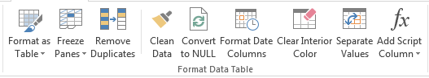
</h1>

These buttons have the following constraints: 
* Only runs on visible columns. Column hiding can be used to control which columns are included in the script formula. 
* Attempt to automatically determine data type of column (text, numeric, date) in order to apply correct quoting and formatting. 
* For numeric columns if a specific number format has been applied to the entire column then this will be used when formatting the data. This can be used to control the specific data load format of a numeric column if needed. 

<a id="user-content-format-as-table" class="anchor" href="#format-as-table" aria-hidden="true"> </a>
####	Format as Table (Button)
* Quickly format a range of cells and convert it to a Table by choosing a Table Style. 

<a id="user-content-freeze-panes" class="anchor" href="#freeze-panes" aria-hidden="true"> </a>
####	Freeze Panes (Button)
* Keep a portion of the sheet visible while the rest of the sheet scrolls

<a id="user-content-remove-duplicates" class="anchor" href="#remove-duplicates" aria-hidden="true"> </a>
#### Remove Duplicates (Button)
* Delete duplicate rows from a sheet

<a id="user-content-script-actions" class="anchor" href="#script-actions" aria-hidden="true"> </a>
### Script Actions (Group)

<h1 align="left">
  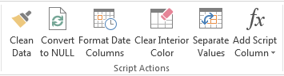
</h1>

<a id="user-content-clean-data" class="anchor" href="#clean-data" aria-hidden="true"> </a>
#### Clean Data (Button)
* This feature runs through all the data in the table and removes unprintable characters and trims leading and trailing spaces. 
* The number of cells cleaned is shown in a message box and cleaned cells are highlighted. 
* Currently, there must be at least 2 rows in the table

<h1 align="left">
  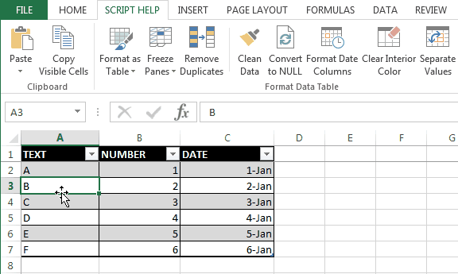
</h1>

<a id="user-content-convert-to-null" class="anchor" href="#convert-to-null" aria-hidden="true"> </a>
####	Convert to Null (Button)
* Replaces the zero string values in a named range with “NULL” text value.

<h1 align="left">
  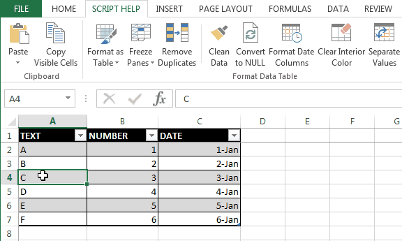
</h1>

<a id="user-content-format-date-columns" class="anchor" href="#format-date-columns" aria-hidden="true"> </a>
#### Format Date Columns (Button)
* When data is cut and pasted from SSMS into Excel, for whatever reason, Excel chooses to format the dates with the (useless) format "mm:ss.0". This seems to be impossible to configure. 
* This feature applies the format "dd-mmm-yyyy" to all date columns it detects in the active table.  If there are zero strings in the column instead of “NULL”s, then the column is treated as a string.
<h1 align="left">
  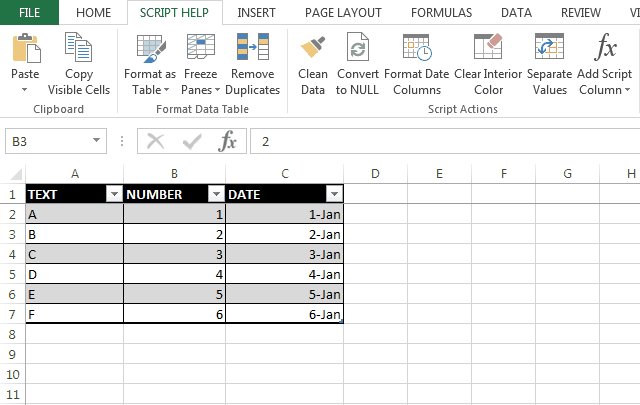
</h1>

<a id="user-content-clear-interior-color" class="anchor" href="#clear-interior-color" aria-hidden="true"> </a>
#### Clear Interior Color (Button)
* Clears the interior color of cells in a named range or data table.

<a id="user-content-separate-values" class="anchor" href="#separate-values" aria-hidden="true"> </a>
#### Separate Values (Button)
* Separate values into new rows from the selected column by a delimited string value setting
<h1 align="left">
  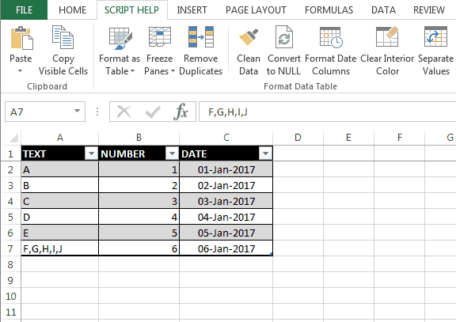
</h1>

<a id="user-content-add-script-column" class="anchor" href="#add-script-column" aria-hidden="true"> </a>
#### Add Script Column (Menu Buttons)
<h1 align="left">
  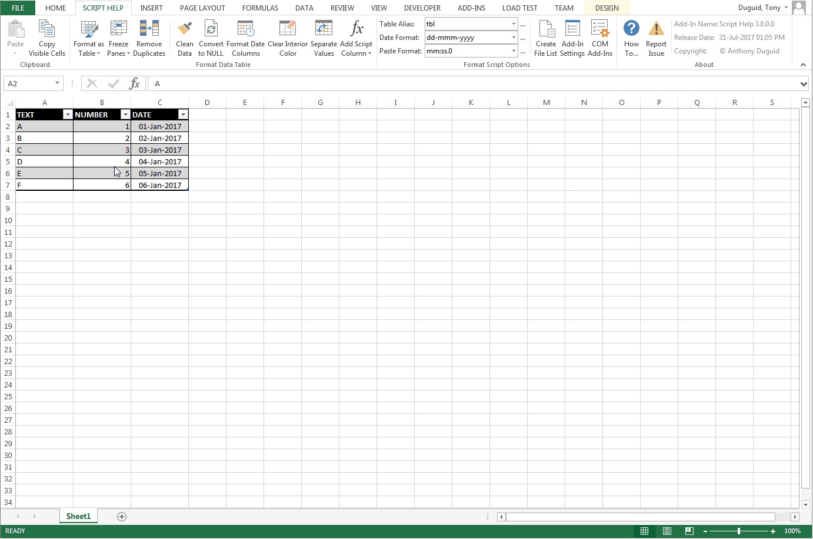
</h1>

<a id="user-content-menu-tsql" class="anchor" href="#menu-tsql" aria-hidden="true"> </a>
<kbd><a href="#menu-tsql" target="_blank"></a></kbd>
T-SQL (Transact-Structured Query Language)
  - T-SQL Create Table - This menu item will format the script column to drop/create the table then insert the values
  - T-SQL Insert Values – This menu item will format the script column to use individual insert statements
  - T-SQL Merge Values – This menu item will format the script column to use a merge statement with a select values
  - T-SQL Select Values – This menu item will format the script column to be used in insert statements 
  - T-SQL Select Union – This menu item will format the script column to be used in an update statement 
  - T-SQL Update Values – This menu item will format the script column to use individual update statements

<a id="user-content-menu-plsql" class="anchor" href="#menu-plsql" aria-hidden="true"> </a>
<kbd><a href="#menu-plsql" target="_blank"></a></kbd>
PL/SQL (Procedural Language/Structured Query Language)
  - PL/SQL Create Table - This menu item will format the script column to drop/create the table then insert the values
  - PL/SQL Insert Values – This menu item will format the script column to use individual insert statements
  - PL/SQL Merge Values - This menu item will format the script column to use a merge statement with a select values
  - PL/SQL Select Values - This menu item will format the script column to be used in insert statements 
  - PL/SQL Select Union – This menu item will format the script column to be used in an update statement 
  - PL/SQL Update Values – This menu item will format the script column to use individual update statements

<a id="user-content-menu-dql" class="anchor" href="#menu-dql" aria-hidden="true"> </a>
<kbd><a href="#menu-dql" target="_blank"></a></kbd>
DQL (Documentum Query Language)
  - DQL Append – This menu item will format the script column to be used in an append statement for Documentum (this is used for repeating values)
  - DQL Append/Locked – This menu item will format the script column to be used in an append statement for Documentum (this is used for repeating values) and unlocks and then locks the record.
    - The table must contain a column header with 'WHERE'. 
    - Add “WHERE” before the column name in the header you want to use as criteria.
  - DQL Create – This menu item will format the script column to be used in an create statement for Documentum
  - DQL Truncate/Append – This menu item will format the script column to be used in an truncate and then append statement for Documentum (this is used for repeating values).
    * The table must contain a column header with 'WHERE'. 
    * Add “WHERE” before the column name in the header you want to use as criteria.
  - DQL Update – This menu item will format the script column to be used in an update statement for Documentum
  - DQL Update/Locked – This menu item will format the script column to be used in an update statement for Documentum and unlocks and then locks the record.
    - The table must contain a column header with 'WHERE'. 
    - Add “WHERE” before the column name in the header you want to use as criteria.

<a id="user-content-menu-github" class="anchor" href="#menu-github" aria-hidden="true"> </a>
<kbd><a href="#menu-github" target="_blank"></a></kbd>
GitHub Markdown
  - GitHub table - creates a table format for GitHub Read Me documentation

<a id="user-content-menu-markup" class="anchor" href="#menu-markup" aria-hidden="true"> </a>
<kbd><a href="#menu-markup" target="_blank"></a></kbd>
Markup Language
  - HTML Table - creates a HTML table structure
  - XML Values - creates XML structure

<a id="user-content-format-script-options" class="anchor" href="#format-script-options" aria-hidden="true"> </a>
###	Script Variables (Group)
<h1 align="left">
  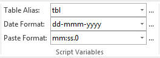
</h1>

<a id="user-content-table-alias" class="anchor" href="#table-alias" aria-hidden="true"> </a>
#### Table Alias (Dropdown)
* Changes the prefix to the header and footer line script column
* These values can be updated using the build button “…” to the right of the dropdown

<a id="user-content-date-find-format" class="anchor" href="#date-find-format" aria-hidden="true"> </a>
#### Date Find Format (Dropdown)
* This is the format the script looks for to finds dates
* It defaults to ‘mm:ss.0’, and can be changed by the dropdown value or free text
* These values can be updated using the build button “…” to the right of the “Date Format” dropdown

<a id="user-content-date-replace-format" class="anchor" href="#date-replace-format" aria-hidden="true"> </a>
#### Date Replace Format (Dropdown)
* This is the date format the script uses to replace the formatting for date columns. 
* It defaults to ‘dd-mmm-yyyy’, and can be changed by the dropdown value or free text
* These values can be updated using the build button “…” to the right of the dropdown

<a id="user-content-options" class="anchor" href="#options" aria-hidden="true"> </a>
###	Options (Group)
<h1 align="left">
  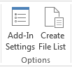
</h1>

<a id="user-content-settings" class="anchor" href="#settings" aria-hidden="true"> </a>
#### Add-In Settings (Button)

<kbd>
VSTO
<br>
  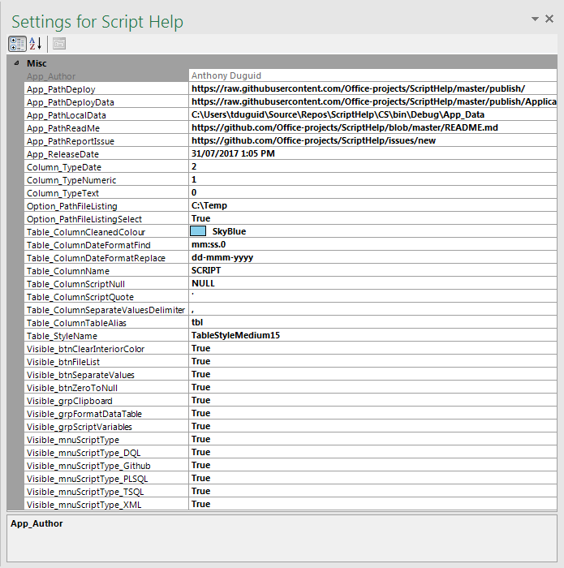
</kbd>

- Types of VSTO Settings
  - Application Settings
    - These settings can only be changed in the project and need to be redeployed
    - They will appear disabled in the form
  - User Settings
    - These settings can be changed by the end-user
    - They will appear enabled in the form
    
<kbd>
VBA
<br>
  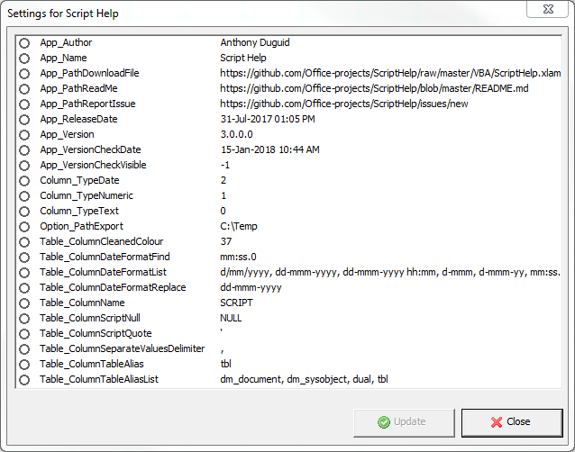
</kbd>

- VBA Settings
  - To add a new setting
    ```vbnet
    ThisWorkbook.CustomDocumentProperties.Add _
    Name:="App_ReleaseDate" _
    , LinkToContent:=False _
    , Type:=msoPropertyTypeDate _
    , Value:="31-Jul-2017 1:05pm"
    ```
  - To update a setting
    ```vbnet
    ThisWorkbook.CustomDocumentProperties.Item("App_ReleaseDate").Value = "31-Jul-2017 1:05pm"
    ```
  - To delete a setting
    ```vbnet
    ThisWorkbook.CustomDocumentProperties.Item("App_ReleaseDate").Delete
    ```

<a id="user-content-create-file-list" class="anchor" href="#create-file-list" aria-hidden="true"> </a>
#### Create File List (Button)
* This will create a file listing recursively from a user selected directory
* It will save the .csv and .bat file in the root folder selected.

<a id="user-content-help" class="anchor" href="#help" aria-hidden="true"> </a>
###	Help (Group)
<h1 align="left">
  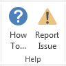
</h1>

<a id="user-content-how-to" class="anchor" href="#how-to" aria-hidden="true"> </a>
#### How To… (Button)
* Opens a webpage of the read me documentation

<a id="user-content-api-doc" class="anchor" href="#api-doc" aria-hidden="true"> </a>
#### Report Issue (Button)
* Opens a page to create a new issue for the product

<a id="user-content-about" class="anchor" href="#about" aria-hidden="true"> </a>
###	About (Group)
<h1 align="left">
  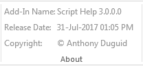
</h1>

<a id="user-content-description" class="anchor" href="#description" aria-hidden="true"> </a>
#### Add-in Name (Label)
* The application name with the version [](https://raw.githubusercontent.com/aduguid/ScriptHelp/master/Images/ReadMe/ribbon.easteregg.gif "Easter Egg")

<a id="user-content-install-date" class="anchor" href="#install-date" aria-hidden="true"> </a>
#### Release Date (Label)
* The release date of the application

<a id="user-content-copyright" class="anchor" href="#copyright" aria-hidden="true"> </a>
#### Copyright (Label)
* The author’s name

</body>
</html>
