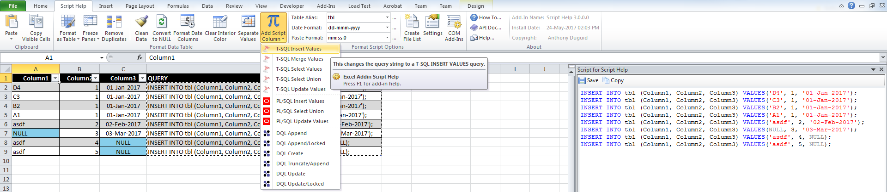

# ScriptHelp
<h1 align="center">
  
</h1>
This is an Excel 2010 VSTO Addin written in Visual Studio 2013 C#. It allows the user to use an Excel table to create different SQL scripts.

## Glossary of Terms

| Term                      | Meaning                                                                                  |
|:--------------------------|:-----------------------------------------------------------------------------------------|
| COM |Component Object Model (COM) is a binary-interface standard for software components introduced by Microsoft in 1993. It is used to enable inter-process communication and dynamic object creation in a large range of programming languages. COM is the basis for several other Microsoft technologies and frameworks, including OLE, OLE Automation, ActiveX, COM+, DCOM, the Windows shell, DirectX, UMDF and Windows Runtime.  |
|DQL |DQL is used to query Documentum which is a content management system used to create, manage, deliver, and archive all types of content from text documents and spreadsheets to digital images, HTML, and XML components. DQL uses syntax that is a superset of ANSI-standard SQL (Structured Query Language) DQL statements operate on objects and sometimes on tables/rows but SQL statements operate only on tables/rows |
|PL/SQL |PL/SQL (Procedural Language/Structured Query Language) is Oracle Corporation's procedural extension for SQL and the Oracle relational database |
|T-SQL |Transact-SQL (T-SQL) is Microsoft's and Sybase's proprietary extension to SQL. SQL, the acronym for Structured Query Language | 
|UNION |The SQL UNION operator combines the result of two or more SELECT statements.|
|VSTO |Visual Studio Tools for Office (VSTO) is a set of development tools available in the form of a Visual Studio add-in (project templates) and a runtime that allows Microsoft Office 2003 and later versions of Office applications to host the .NET Framework Common Language Runtime (CLR) to expose their functionality via .NET.|

## Button Functionality
<h1 align="center">
  
</h1>

* T-SQL Insert Values – This menu item will format the script column to use individual insert statements
* T-SQL Merge Values – This menu item will format the script column to use a merge statement with a select values
* T-SQL Select Values – This menu item will format the script column to be used in insert statements 
* T-SQL Select Union – This menu item will format the script column to be used in an update statement 
* T-SQL Update Values – This menu item will format the script column to use individual update statements
* PL/SQL Insert Values – This menu item will format the script column to use individual insert statements
* PL/SQL Select Union – This menu item will format the script column to be used in an update statement 
* PL/SQL Update Values – This menu item will format the script column to use individual update statements
* DQL Append – This menu item will format the script column to be used in an append statement for Documentum (this is used for repeating values)
* DQL Append/Locked – This menu item will format the script column to be used in an append statement for Documentum (this is used for repeating values) and unlocks and then locks the record
* DQL Create – This menu item will format the script column to be used in an create statement for Documentum
* DQL Truncate/Append – This menu item will format the script column to be used in an truncate and then append statement for Documentum (this is used for repeating values)
* DQL Update – This menu item will format the script column to be used in an update statement for Documentum
* DQL Update/Locked – This menu item will format the script column to be used in an update statement for Documentum and unlocks and then locks the record
  * Add “WHERE” before the column name in the header you want to use as criteria.
  * The “Table Alias” is used as the update table name
  * This window will pop-up on “Add Script Column” click. “Save” from the toolbar will save the text to a script file.
