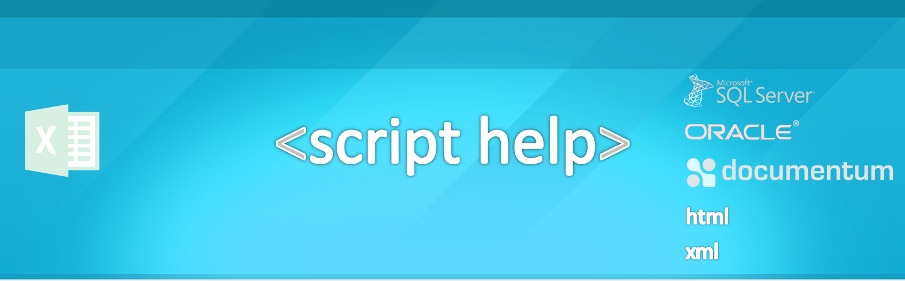
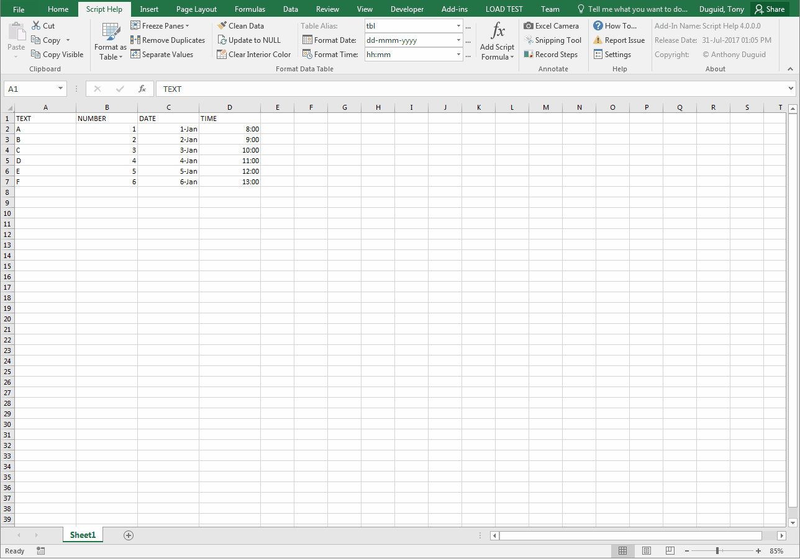
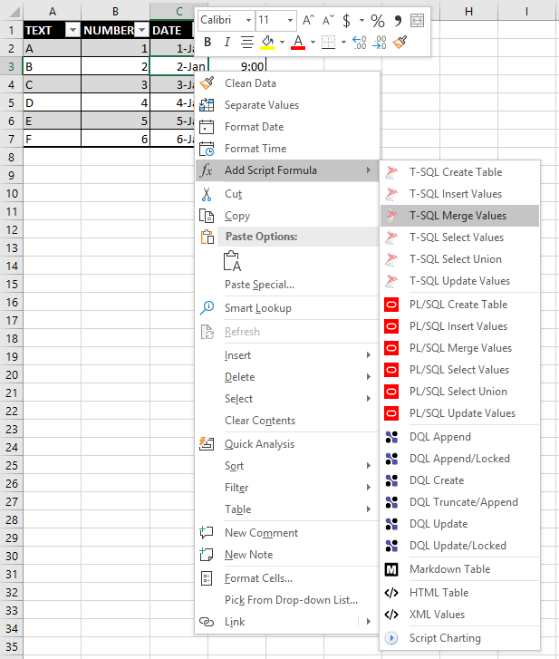
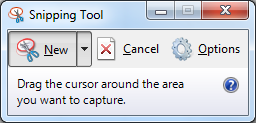
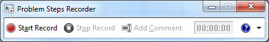

This Add-In is used for cleaning & creating a script for batch loading records into SQL Server, Oracle, Documentum, Markup or Markdown Languages. The functionality within the ribbon allows a quick way of preparing a bulk data load. Otherwise, the requests can be both time-consuming and error prone. It is written in 3 different versions as a VSTO Add-In in C# and VB.NET as well as a VBA Add-In. The most complete version is C#. 

<!--[](https://www.paypal.me/AnthonyDuguid/1.00)-->
[](https://gitter.im/ScriptHelp?utm_source=badge&utm_medium=badge&utm_campaign=pr-badge&utm_content=badge)
[](LICENSE "MIT License Copyright © Anthony Duguid")
[](https://github.com/Excel-projects/Script-Help/releases)
[](https://github.com/Excel-projects/Script-Help/commits/master)
[](https://github.com/Excel-projects/Script-Help/issues)
<!--[](https://github.com/Excel-projects/Script-Help/releases)-->


<h1 align="left">
  
</h1>

<br>

<details>
  <summary><b>Table of Contents</b></summary>
  
- <a href="#install">Install</a>
- <a href="#dependencies">Dependencies</a>
- <a href="#glossary-of-terms">Glossary of Terms</a>
- <a href="#functionality">Functionality</a> 
    - <a href="#keytips">Key Tips</a>
    - <a href="#clipboard">Clipboard</a>
    - <a href="#format-data-table">Format Data Table</a>
    - <a href="#annotate">Annotate</a>
    - <a href="#help">Help</a>
    - <a href="#about">About</a>
</details>

<a id="user-content-install" class="anchor" href="#install" aria-hidden="true"> </a>
<details>
  <summary><b>Install</b></summary>
Instructions for installation of VBA and VSTO versions.

### VBA
How to install the VBA version
1. Download the VBA Add-In file [](https://github.com/Excel-projects/Script-Help/raw/master/VBA/ScriptHelp.xlam?raw=true "Download the VBA Add-In").
2. Copy the file to the XLSTART folder on your computer. ```%AppData%\Microsoft\Excel\XLSTART\```
3. Close all open instances of Excel and then launch Excel. The new ribbon should appear.

### VSTO
How to install the VSTO version
1. Download AnthonyDuguid.pfx And Install At Root Level [](https://github.com/Office-projects/Script-Help/blob/master/CS/AnthonyDuguid.pfx?raw=true "Download AnthonyDuguid.pfx And Install At Root Level For VSTO")
2. Download and run the setup.exe file. [](https://github.com/Excel-projects/Script-Help/blob/master/CS/publish/setup.exe?raw=true "Download Setup.exe Install File")
</details>

<a id="user-content-dependencies" class="anchor" href="#dependencies" aria-hidden="true"> </a>
<details>
  <summary><b>Dependencies</b></summary>
<br>
  
|Software                                   |Dependency                 |Project                    |
|:------------------------------------------|:--------------------------|:--------------------------|
|[Microsoft Visual Studio Community](https://www.visualstudio.com/vs/whatsnew/)|Solution|VSTO|
|[Microsoft Office Developer Tools](https://visualstudio.microsoft.com/vs/features/office-tools/)|Solution|VSTO|
|[Microsoft Excel 2010 (or later)](https://www.microsoft.com/en-au/software-download/office)|Project|VBA, VSTO|
|[Visual Basic for Applications](https://msdn.microsoft.com/en-us/vba/vba-language-reference)|Code|VBA|
|[Extensible Markup Language (XML)](https://www.rondebruin.nl/win/s2/win001.htm)|Ribbon|VBA, VSTO|
|[Microsoft SQL Server CE 3.5](https://www.microsoft.com/en-au/download/details.aspx?id=5783)|Database|VSTO|
|[SQL Server Compact Toolbox](https://marketplace.visualstudio.com/items?itemName=ErikEJ.SQLServerCompactSQLiteToolbox)|Database|VSTO|
|[Log4Net](https://www.nuget.org/packages/log4net/) |Error Logging |VSTO|
|[ScreenToGif](http://www.screentogif.com/)|Read Me|VBA, VSTO|
|[Snagit](http://discover.techsmith.com/snagit-non-brand-desktop/?gclid=CNzQiOTO09UCFVoFKgod9EIB3g)|Read Me|VBA, VSTO|
|Badges ([Library](https://shields.io/), [Custom](https://rozaxe.github.io/factory/), [Star/Fork](http://githubbadges.com))|Read Me|VBA, VSTO|
</details>

<a id="user-content-glossary-of-terms" class="anchor" href="#glossary-of-terms" aria-hidden="true"> </a>
<details>
  <summary><b>Glossary of Terms</b></summary>
<br>
  
| Term                      | Meaning                                                                                  |
|:--------------------------|:-----------------------------------------------------------------------------------------|
| COM |Component Object Model (COM) is a binary-interface standard for software components introduced by Microsoft in 1993. It is used to enable inter-process communication and dynamic object creation in a large range of programming languages. COM is the basis for several other Microsoft technologies and frameworks, including OLE, OLE Automation, ActiveX, COM+, DCOM, the Windows shell, DirectX, UMDF and Windows Runtime.  |
| DQL |DQL is used to query Documentum which is a content management system used to create, manage, deliver, and archive all types of content from text documents and spreadsheets to digital images, HTML, and XML components. DQL uses syntax that is a superset of ANSI-standard SQL (Structured Query Language) DQL statements operate on objects and sometimes on tables/rows but SQL statements operate only on tables/rows |
| HTML|Hypertext Markup Language is the standard markup language for creating web pages and web applications|
| PL/SQL |PL/SQL (Procedural Language/Structured Query Language) is Oracle Corporation's procedural extension for SQL and the Oracle relational database |
| T-SQL |Transact-SQL (T-SQL) is Microsoft's and Sybase's proprietary extension to SQL. SQL, the acronym for Structured Query Language | 
| UNION |The SQL UNION operator combines the result of two or more SELECT statements.|
| VBA |Visual Basic for Applications (VBA) is an implementation of Microsoft's event-driven programming language Visual Basic 6 and uses the Visual Basic Runtime Library. However, VBA code normally can only run within a host application, rather than as a standalone program. VBA can, however, control one application from another using OLE Automation. VBA can use, but not create, ActiveX/COM DLLs, and later versions add support for class modules.|
| VSTO |Visual Studio Tools for Office (VSTO) is a set of development tools available in the form of a Visual Studio add-in (project templates) and a runtime that allows Microsoft Office 2003 and later versions of Office applications to host the .NET Framework Common Language Runtime (CLR) to expose their functionality via .NET.|
| XML|Extensible Markup Language (XML) is a markup language that defines a set of rules for encoding documents in a format that is both human-readable and machine-readable.The design goals of XML emphasize simplicity, generality, and usability across the Internet. It is a textual data format with strong support via Unicode for different human languages. Although the design of XML focuses on documents, the language is widely used for the representation of arbitrary data structures such as those used in web services.|
</details>
<br>

<a id="user-content-functionality" class="anchor" href="#functionality" aria-hidden="true"> </a>
## Functionality
This Excel ribbon is inserted after the “Home” tab when Excel opens. Listed below is the detailed functionality of this application and its components.  

<a id="user-content-rightclick" class="anchor" href="#rightclick" aria-hidden="true"> </a>
### Right Click Menu 
This custom context menu is only available inside an Excel table. [shortcut menu](https://github.com/Excel-projects/Script-Help/blob/master/CS/Ribbon.xml#L665-L839)

<h1 align="left">
  
</h1>

<a id="user-content-keytips" class="anchor" href="#keytips" aria-hidden="true"> </a>
###	Key Tips
A [KeyTip](https://msdn.microsoft.com/en-us/library/microsoft.office.tools.ribbon.ribbonbutton.keytip.aspx) must be from 1 to 3 uppercase characters, and must not contain spaces, tabs, or newline characters. KeyTips are sometimes known as access keys or accelerators and are used as shortcut key combinations that activate controls. KeyTips appear on the Ribbon when you press the ALT key. If your KeyTip conflicts with KeyTips for built-in controls or from other add-ins, Microsoft Office might assign non-conflicting KeyTip values automatically. This is available in the VBA version only.

<a id="user-content-clipboard" class="anchor" href="#clipboard" aria-hidden="true"> </a>
###	Clipboard (Group)

<a id="user-content-paste" class="anchor" href="#paste" aria-hidden="true"> </a>
####	Paste (Menu)
* Paste the contents of the clipboard

####	Copy (Button)
* Copies the selection on to the clipboard so you can paste it somewhere else

<a id="user-content-copy-visible-cells" class="anchor" href="#copy-visible-cells" aria-hidden="true"> </a>
####	Copy Visible ([Button](https://github.com/Excel-projects/Script-Help/blob/master/CS/Scripts/Ribbon.cs#L843-L869))
* Copies only the visible cells from a selection

<a id="user-content-format-data-table" class="anchor" href="#format-data-table" aria-hidden="true"> </a>
### Format Data Table (Group)

These buttons have the following constraints: 
* Only runs on visible columns. Column hiding can be used to control which columns are included in the script formula. 
* Attempt to automatically determine data type of column (text, numeric, date) in order to apply correct quoting and formatting. 
* For numeric columns if a specific number format has been applied to the entire column then this will be used when formatting the data. This can be used to control the specific data load format of a numeric column if needed. 

<a id="user-content-format-as-table" class="anchor" href="#format-as-table" aria-hidden="true"> </a>
####	Format as Table (Button)
* Quickly format a range of cells and convert it to a Table by choosing a Table Style. 

<a id="user-content-freeze-panes" class="anchor" href="#freeze-panes" aria-hidden="true"> </a>
####	Freeze Panes (Button)
* Keep a portion of the sheet visible while the rest of the sheet scrolls

<a id="user-content-remove-duplicates" class="anchor" href="#remove-duplicates" aria-hidden="true"> </a>
#### Remove Duplicates (Button)
* Delete duplicate rows from a sheet

<a id="user-content-separate-values" class="anchor" href="#separate-values" aria-hidden="true"> </a>
#### Separate Values ([Button](https://github.com/Excel-projects/Script-Help/blob/master/CS/Scripts/Ribbon.cs#L1237-L1296)) 
* Separate values into new rows from the selected column by a delimited string value setting

<a id="user-content-clean-data" class="anchor" href="#clean-data" aria-hidden="true"> </a>
#### Clean Data ([Button](https://github.com/Excel-projects/Script-Help/blob/master/CS/Scripts/Ribbon.cs#L871-L943))
* This feature runs through all the data in the table and removes unprintable characters and trims leading and trailing spaces. 
* The number of cells cleaned is shown in a message box and cleaned cells are highlighted. 

<a id="user-content-convert-to-null" class="anchor" href="#convert-to-null" aria-hidden="true"> </a>
####	Convert to Null ([Button](https://github.com/Excel-projects/Script-Help/blob/master/CS/Scripts/Ribbon.cs#L945-L997))
* Replaces the zero string values in a named range with “NULL” text value.

<a id="user-content-clear-interior-color" class="anchor" href="#clear-interior-color" aria-hidden="true"> </a>
#### Clear Interior Color ([Button](https://github.com/Excel-projects/Script-Help/blob/master/CS/Scripts/Ribbon.cs#L1189-L1235))
* Clears the interior color of cells in a named range or data table.

<a id="user-content-table-alias" class="anchor" href="#table-alias" aria-hidden="true"> </a>
#### Table Alias ([Dropdown](https://github.com/Excel-projects/Script-Help/blob/master/CS/Scripts/Data.cs#L47-L79))
* Changes the prefix to the header and footer line script column
* These values can be updated using the build button “…” to the right of the dropdown

<a id="user-content-format-date-columns" class="anchor" href="#format-date-columns" aria-hidden="true"> </a>
#### Format Date ([Button](https://github.com/Excel-projects/Script-Help/blob/master/CS/Scripts/Ribbon.cs#L999-L1046))
* This feature applies the selected format from the dropdown e.g. "dd-mmm-yyyy" to all date columns it detects in the active table.  If there are zero strings in the column instead of “NULL”s, then the column is treated as a string.
* When data is cut and pasted from SSMS into Excel, for whatever reason, Excel chooses to format the dates with the (useless) format "mm:ss.0". This seems to be impossible to configure. 

<a id="user-content-date-find-format" class="anchor" href="#date-find-format" aria-hidden="true"> </a>
#### Format Date ([Dropdown](https://github.com/Excel-projects/Script-Help/blob/master/CS/Scripts/Data.cs#L81-L113))
* This is the format the script looks for to finds dates
* These values can be updated using the build button “…” to the right of the “Date Format” dropdown

#### Format Time ([Button](https://github.com/Excel-projects/Script-Help/blob/master/CS/Scripts/Ribbon.cs#L1099-L1146))
* This feature applies the selected format from the dropdown e.g. "hh:mm" to selected column from the active cell.

<a id="user-content-date-replace-format" class="anchor" href="#date-replace-format" aria-hidden="true"> </a>
#### Format Time ([Dropdown](https://github.com/Excel-projects/Script-Help/blob/master/CS/Scripts/Data.cs#L115-L147))
* This is the date format the script uses to replace the formatting for date columns. 
* It defaults to ‘dd-mmm-yyyy’, and can be changed by the dropdown value or free text
* These values can be updated using the build button “…” to the right of the dropdown

<a id="user-content-add-script-column" class="anchor" href="#add-script-column" aria-hidden="true"> </a>
#### Add Script Formula (Menu Buttons) [ribbon menu](https://github.com/Excel-projects/Script-Help/blob/master/CS/Ribbon.xml#L307-L516)

<a id="user-content-menu-tsql" class="anchor" href="#menu-tsql" aria-hidden="true"> </a>
<kbd><a href="#menu-tsql" target="_blank"></a></kbd>
T-SQL (Transact-Structured Query Language)
  - [T-SQL Create Table](https://github.com/Excel-projects/Script-Help/blob/master/CS/Scripts/Formula.cs#L1802-L1910) - This menu item will format the script column to drop/create the table then insert the values
  - [T-SQL Insert Values](https://github.com/Excel-projects/Script-Help/blob/master/CS/Scripts/Formula.cs#L1912-L2012) – This menu item will format the script column to use individual insert statements
  - [T-SQL Merge Values](https://github.com/Excel-projects/Script-Help/blob/master/CS/Scripts/Formula.cs#L2014-L2151) – This menu item will format the script column to use a merge statement with a select values
  - [T-SQL Select Values](https://github.com/Excel-projects/Script-Help/blob/master/CS/Scripts/Formula.cs#L2257-L2364) – This menu item will format the script column to be used in insert statements 
  - [T-SQL Select Union](https://github.com/Excel-projects/Script-Help/blob/master/CS/Scripts/Formula.cs#L2153-L2255) – This menu item will format the script column to be used in an update statement 
  - [T-SQL Update Values](https://github.com/Excel-projects/Script-Help/blob/master/CS/Scripts/Formula.cs#L2366-L2514) – This menu item will format the script column to use individual update statements

<a id="user-content-menu-plsql" class="anchor" href="#menu-plsql" aria-hidden="true"> </a>
<kbd><a href="#menu-plsql" target="_blank"></a></kbd>
PL/SQL (Procedural Language/Structured Query Language)
  - [PL/SQL Create Table](https://github.com/Excel-projects/Script-Help/blob/master/CS/Scripts/Formula.cs#L1105-L1206) - This menu item will format the script column to drop/create the table then insert the values
  - [PL/SQL Insert Values](https://github.com/Excel-projects/Script-Help/blob/master/CS/Scripts/Formula.cs#L1208-L1308) – This menu item will format the script column to use individual insert statements
  - [PL/SQL Merge Values](https://github.com/Excel-projects/Script-Help/blob/master/CS/Scripts/Formula.cs#L1310-L1437) - This menu item will format the script column to use a merge statement with a select values
  - [PL/SQL Select Values](https://github.com/Excel-projects/Script-Help/blob/master/CS/Scripts/Formula.cs#L1439-L1546) - This menu item will format the script column to be used in insert statements 
  - [PL/SQL Select Union](https://github.com/Excel-projects/Script-Help/blob/fc2e32e00aae03e23d7471ca5075584b5fb04113/CS/Scripts/Formula.cs#L1548-L1650) – This menu item will format the script column to be used in an update statement 
  - [PL/SQL Update Values](https://github.com/Excel-projects/Script-Help/blob/master/CS/Scripts/Formula.cs#L1652-L1800) – This menu item will format the script column to use individual update statements

<a id="user-content-menu-dql" class="anchor" href="#menu-dql" aria-hidden="true"> </a>
<kbd><a href="#menu-dql" target="_blank"></a></kbd>
DQL (Documentum Query Language)
  - [DQL Append](https://github.com/Excel-projects/Script-Help/blob/master/CS/Scripts/Formula.cs#L17-L163) – This menu item will format the script column to be used in an append statement for Documentum (this is used for repeating values)
  - [DQL Append/Locked](https://github.com/Excel-projects/Script-Help/blob/master/CS/Scripts/Formula.cs#L165-L324) – This menu item will format the script column to be used in an append statement for Documentum (this is used for repeating values) and unlocks and then locks the record.
    - The table must contain a column header with 'WHERE'. 
    - Add “WHERE” before the column name in the header you want to use as criteria.
  - [DQL Create](https://github.com/Excel-projects/Script-Help/blob/master/CS/Scripts/Formula.cs#L325-L444) – This menu item will format the script column to be used in an create statement for Documentum
  - [DQL Truncate/Append](https://github.com/Excel-projects/Script-Help/blob/master/CS/Scripts/Formula.cs#L446-L593) – This menu item will format the script column to be used in an truncate and then append statement for Documentum (this is used for repeating values).
    * The table must contain a column header with 'WHERE'. 
    * Add “WHERE” before the column name in the header you want to use as criteria.
  - [DQL Update](https://github.com/Excel-projects/Script-Help/blob/master/CS/Scripts/Formula.cs#L595-L737) – This menu item will format the script column to be used in an update statement for Documentum
  - [DQL Update/Locked](https://github.com/Excel-projects/Script-Help/blob/master/CS/Scripts/Formula.cs#L739-L898) – This menu item will format the script column to be used in an update statement for Documentum and unlocks and then locks the record.
    - The table must contain a column header with 'WHERE'. 
    - Add “WHERE” before the column name in the header you want to use as criteria.

<a id="user-content-menu-github" class="anchor" href="#menu-github" aria-hidden="true"> </a>
<kbd><a href="#menu-github" target="_blank"></a></kbd>
Markdown Language
  - [Markdown table](https://github.com/Excel-projects/Script-Help/blob/master/CS/Scripts/Formula.cs#L900-L985) - creates a table format for Markdown Read Me documentation (e.g. GitHub)

<a id="user-content-menu-markup" class="anchor" href="#menu-markup" aria-hidden="true"> </a>
<kbd><a href="#menu-markup" target="_blank"></a></kbd>
Markup Language
  - [HTML Table](https://github.com/Excel-projects/Script-Help/blob/master/CS/Scripts/Formula.cs#L987-L1103) - creates a HTML table structure
  - [XML Values](https://github.com/Excel-projects/Script-Help/blob/master/CS/Scripts/Formula.cs#L2516-L2631) - creates XML structure

<a id="user-content-annotate" class="anchor" href="#annotate" aria-hidden="true"> </a>
###	Annotate (Group)

<a id="user-content-camera" class="anchor" href="#camera" aria-hidden="true"> </a>
#### Excel Camera(Button)

  - The camera tool allows you to take a snapshot of any selected range of data, table, or graph, and paste it as a linked picture.
The pasted snapshot can be formatted and resized using picture tools. They can be copied and pasted into Word and PowerPoint documents as well. The image is automatically refreshed if the data changes.

<a id="user-content-snip" class="anchor" href="#snip" aria-hidden="true"> </a>
#### Snipping Tool (Button)



  - Capture all or part of your PC screen, add notes, save the snip, or email it from the Snipping Tool window. You can capture any of the following types of snips:
    - Free-form snip. Draw a free-form shape around an object.
    - Rectangular snip. Drag the cursor around an object to form a rectangle.
    - Window snip. Select a window, such as a browser window or dialog box, that you want to capture.
    - Full-screen snip. Capture the entire screen.

<a id="user-content-psr" class="anchor" href="#psr" aria-hidden="true"> </a>
#### Problem Step Recorder (Button)



  - Steps Recorder (called Problems Steps Recorder in Windows 7), is a program that helps you troubleshoot a problem on your device by recording the exact steps you took when the problem occurred. You can then send this record to a support professional to help them diagnose the problem.

<a id="user-content-help" class="anchor" href="#help" aria-hidden="true"> </a>
###	Help (Group)

<a id="user-content-how-to" class="anchor" href="#how-to" aria-hidden="true"> </a>
#### How To… (Button)
* Opens a webpage of the read me documentation

<a id="user-content-api-doc" class="anchor" href="#api-doc" aria-hidden="true"> </a>
#### Report Issue (Button)
* Opens a page to create a new issue for the product

<a id="user-content-settings" class="anchor" href="#settings" aria-hidden="true"> </a>
#### Add-In Settings (Button)

<kbd>
VSTO
<br>
  
</kbd>

- Types of VSTO Settings
  - Application Settings
    - These settings can only be changed in the project and need to be redeployed
    - They will appear disabled in the form
  - User Settings
    - These settings can be changed by the end-user
    - They will appear enabled in the form
    
<kbd>
VBA
<br>
  
</kbd>

- VBA Settings
  - To add a new setting
    ```vbnet
    ThisWorkbook.CustomDocumentProperties.Add _
    Name:="App_ReleaseDate" _
    , LinkToContent:=False _
    , Type:=msoPropertyTypeDate _
    , Value:="31-Jul-2017 1:05pm"
    ```
  - To update a setting
    ```vbnet
    ThisWorkbook.CustomDocumentProperties.Item("App_ReleaseDate").Value = "31-Jul-2017 1:05pm"
    ```
  - To delete a setting
    ```vbnet
    ThisWorkbook.CustomDocumentProperties.Item("App_ReleaseDate").Delete
    ```

<a id="user-content-about" class="anchor" href="#about" aria-hidden="true"> </a>
###	About (Group)
<h1 align="left">
  
</h1>

<a id="user-content-description" class="anchor" href="#description" aria-hidden="true"> </a>
#### Add-in Name (Label)
* The application name with the version [](https://raw.githubusercontent.com/Office-projects/ScriptHelp/master/Images/ReadMe/ribbon.easteregg.gif "Easter Egg")

<a id="user-content-install-date" class="anchor" href="#install-date" aria-hidden="true"> </a>
#### Release Date (Label)
* The release date of the application

<a id="user-content-copyright" class="anchor" href="#copyright" aria-hidden="true"> </a>
#### Copyright (Label)
* The author’s name
